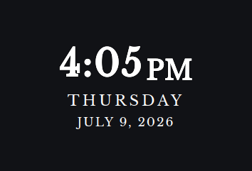
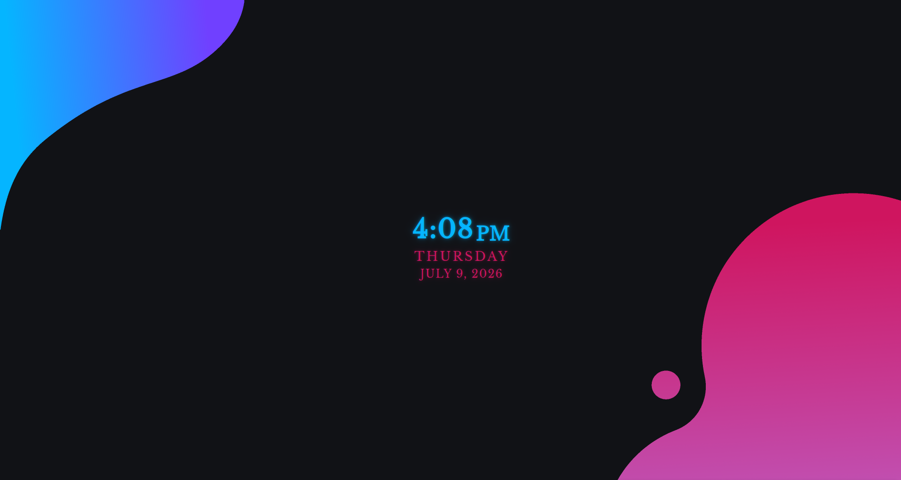
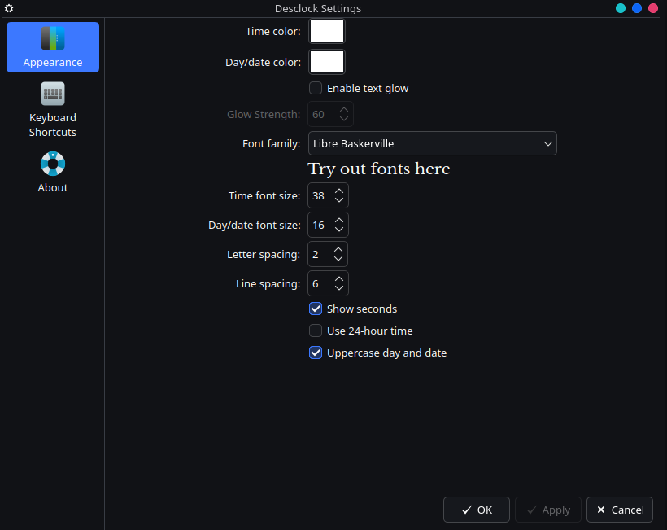

<div align="center">


# DesClock

A clean and customizable desktop clock widget for KDE Plasma 6.


<br>
<br>

<br>
<br>

</div>

## Requirements

- KDE Plasma 6
- Qt 6
- `kpackagetool6`

## Installation

### Install from the KDE Store

DesClock is available through the KDE Store.

1. Right-click an empty area of the KDE Plasma desktop.
2. Select **Add Widgets**.
3. Select **Get New Widgets** → **Download New Plasma Widgets**.
4. Search for **DesClock**.
5. Select **Install**.
6. Drag DesClock from the widget list onto your desktop.

You can also download the `.plasmoid` package directly from the KDE Store and install it using **Install Widget From Local File**.


### Install from source

Clone the repository:

```bash
git clone https://github.com/nsibl/desclock-plasmoid.git
cd desclock-plasmoid
```

Install the widget:

```bash
kpackagetool6 -t Plasma/Applet -i package
```

Then add DesClock to the desktop:

1. Right-click an empty area of the KDE Plasma desktop.
2. Select **Enter Edit Mode**.
3. Select **Add Widgets**.
4. Search for **DesClock**.
5. Drag the widget onto the desktop.
6. Move and resize it as desired.
7. Exit Edit Mode.

## Updating

Pull the latest changes:

```bash
git pull
```

Update the installed widget:

```bash
kpackagetool6 -t Plasma/Applet -u package
```

If changes do not appear immediately, log out and back in.

## Usage

Right-click DesClock and select **Configure DesClock** to customize:

- Time color
- Day and date color
- Font family
- Time font size
- Day and date font size
- Letter spacing
- Line spacing
- 12-hour or 24-hour time
- Show or hide seconds
- Uppercase day and date
- Text glow effect
- Glow strength

### Moving and resizing

Plasma manages widget positioning.

To move or resize DesClock:

1. Right-click the desktop.
2. Select **Enter Edit Mode**.
3. Hover over DesClock.
4. Drag or resize the widget.
5. Exit Edit Mode.

### Using additional fonts

DesClock includes Libre Baskerville and also supports fonts installed on the local system.

User-installed fonts are commonly stored in:

```text
~/.local/share/fonts/
```

After manually adding a font, refresh the font cache:

```bash
fc-cache -f
```

Reopen the DesClock settings window if the new font does not immediately appear.


## License

DesClock is licensed under the [GNU General Public License v3.0](LICENSE).

The bundled Libre Baskerville font is licensed separately under the SIL Open Font License. Its license is included in:

```text
package/contents/fonts/OFL.txt
```

## Credits

Created by Noah Sibley.

Built with KDE Plasma 6, QML, Qt Quick, and Kirigami.